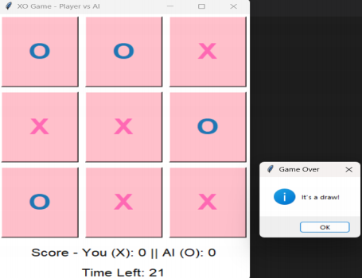

# XO-Game - Player vs AI

A simple Tic-Tac-Toe (XO) game built using Python and Tkinter, where you play against an AI that uses the Minimax algorithm.

## Features

- **Player vs AI:** Challenge the AI to win or draw.
- **Minimax AI:** The AI plays optimally, making the game challenging.
- **Score Tracking:** Keep track of wins for both the player and AI.
- **Timer:** 30-second countdown for each game.
- **User-Friendly GUI:** Color-coded buttons for player and AI moves.

## Screenshots

 

## Installation


## Installation

1. Make sure you have Python installed (3.6+ recommended).
2. Clone the repository:
   ```bash
   git clone https://github.com/your-username/xo-game.git
